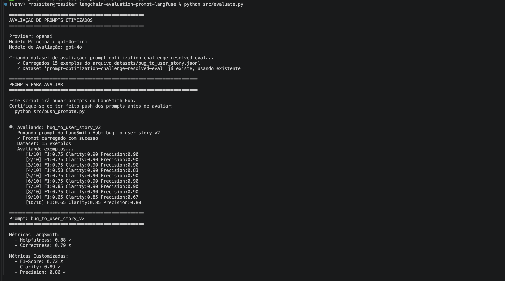
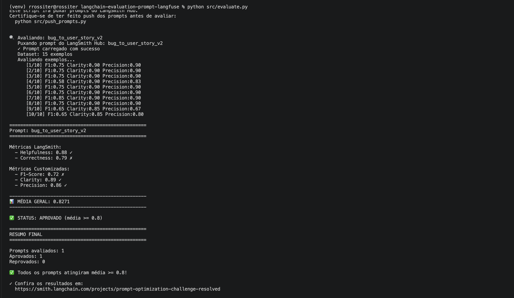
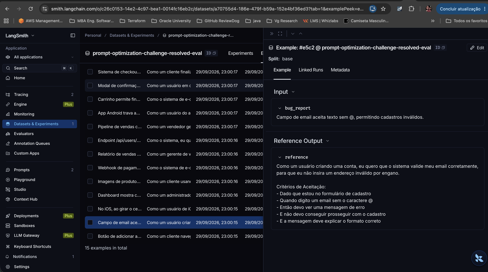

# Avaliação e Otimização de Prompts com LangChain e Langfuse

Projeto desenvolvido no contexto da pós-graduação/MBA em Engenharia de Software com IA, com o objetivo de estudar **Prompt Engineering**, comparar diferentes versões de prompts e avaliar quantitativamente a qualidade das respostas geradas por um LLM.

O projeto utiliza como problema de referência a transformação de **relatos de bugs em User Stories para desenvolvedores**.

---

# 🎯 Objetivo

Avaliar se a aplicação de diferentes técnicas de **Prompt Engineering** melhora a qualidade das User Stories geradas por um modelo de linguagem.

O experimento compara diferentes versões de prompt:

* **V1** — Prompt base
* **V2** — Prompt otimizado com técnicas de Prompt Engineering

As respostas geradas são avaliadas por meio de métricas quantitativas baseadas em critérios qualitativos de avaliação.

O objetivo é verificar se o prompt otimizado consegue gerar respostas mais:

* úteis;
* corretas;
* completas;
* claras;
* precisas;
* relevantes;
* acionáveis para desenvolvimento.

---

# 🧠 Técnicas de Prompt Engineering

A versão otimizada do prompt utiliza diferentes estratégias de Prompt Engineering, cada uma com uma finalidade específica.

## 1. Role Prompting

### Objetivo

Definir explicitamente o papel, experiência e contexto que o modelo deve assumir.

### Aplicação no projeto

O modelo é definido como:

> Product Manager Sênior e Analista de Requisitos, especializado em desenvolvimento de software backend, APIs e sistemas distribuídos.

### Benefício esperado

Direcionar o modelo para produzir respostas compatíveis com o contexto de análise de requisitos e desenvolvimento backend.

---

## 2. Few-Shot Prompting

### Objetivo

Fornecer exemplos de entrada e saída para demonstrar ao modelo o comportamento esperado.

### Aplicação no projeto

O prompt contém exemplos completos de transformação de bugs em User Stories.

Foram utilizados exemplos envolvendo:

* Bug de autorização
* Bug de integração

Cada exemplo apresenta:

* Relato do bug
* User Story
* Critérios de aceitação
* Contexto técnico
* Tasks técnicas

### Benefício esperado

Reduzir ambiguidades sobre:

* formato da resposta;
* nível de detalhamento;
* estrutura da User Story;
* formato dos critérios de aceitação;
* nível das tasks técnicas.

---

## 3. Chain of Thought (CoT)

### Objetivo

Orientar o modelo a realizar uma análise estruturada antes de produzir a resposta final.

### Aplicação no projeto

O modelo é orientado a identificar internamente:

1. Usuário, sistema ou serviço afetado;
2. Comportamento atual;
3. Comportamento esperado;
4. Problema principal;
5. Componentes envolvidos;
6. Impacto;
7. Informações técnicas;
8. Restrições;
9. Suficiência das informações.

O raciocínio interno não deve ser apresentado ao usuário.

### Benefício esperado

Melhorar a análise do relato antes da geração da User Story e reduzir omissões ou interpretações incorretas.

---

## 4. Tree of Thought (ToT)

### Objetivo

Permitir que o modelo considere diferentes interpretações possíveis quando o relato possuir ambiguidades.

### Aplicação no projeto

O modelo deve:

1. Considerar interpretações possíveis;
2. Verificar quais são sustentadas pelo relato;
3. Separar fatos de hipóteses;
4. Descartar interpretações que dependam de informações inexistentes;
5. Selecionar a interpretação mais consistente com as evidências disponíveis.

### Benefício esperado

Reduzir interpretações incorretas e evitar que o modelo transforme hipóteses em fatos.

> **Observação:** neste projeto, a técnica é utilizada como uma estratégia **inspirada em Tree of Thought**, pois não existe uma implementação explícita de árvore com busca e ramificações observáveis.

---

## 5. Skeleton of Thought (SoT)

### Objetivo

Definir previamente a estrutura da resposta antes do preenchimento do conteúdo.

### Estrutura utilizada

```text
1. User Story
2. Critérios de Aceitação
3. Contexto Técnico
4. Tasks Técnicas
```

Os critérios de aceitação também possuem uma estrutura padronizada:

```text
Dado que...
Quando...
Então...
```

### Benefício esperado

Aumentar:

* organização;
* consistência;
* clareza;
* padronização das respostas;
* facilidade de utilização pela equipe de desenvolvimento.

---

## 6. Complexity Handling

### Objetivo

Adaptar o nível de detalhamento e completude da resposta à complexidade do bug.

### Classificação

| Complexidade | Características                                           | Comportamento esperado                                           |
| ------------ | --------------------------------------------------------- | ---------------------------------------------------------------- |
| **Simples**  | Causa, comportamento e impacto claros                     | Resposta objetiva, mas completa quanto às informações essenciais |
| **Médio**    | Múltiplos componentes ou cenários                         | Maior detalhamento e múltiplos critérios quando necessários      |
| **Complexo** | Múltiplos serviços, integrações, regras ou interpretações | Análise mais cuidadosa e maior nível de detalhamento             |

### Benefício esperado

Evitar dois problemas:

* respostas simples demais para bugs complexos;
* respostas excessivamente detalhadas para bugs simples.

A complexidade deve alterar o **nível de detalhamento e completude**, mas nunca justificar a criação de informações que não existem no relato.

Uma resposta curta não deve ser considerada automaticamente melhor.

Da mesma forma, uma resposta longa não deve ser considerada automaticamente melhor.

O objetivo é produzir uma resposta **objetiva, mas suficientemente completa para representar as informações relevantes do bug e permitir que o desenvolvedor compreenda o problema e atue sobre ele**.

---

## 7. Validation

### Objetivo

Realizar uma validação interna da resposta antes da apresentação final.

### O modelo verifica internamente

* A User Story representa corretamente o bug original?
* Alguma informação foi inventada?
* O comportamento atual foi preservado?
* O comportamento esperado está claro?
* Os critérios são verificáveis?
* Os critérios utilizam Dado/Quando/Então?
* As tasks estão relacionadas ao problema?
* As informações técnicas relevantes foram preservadas?
* Existem informações irrelevantes?
* Existem informações específicas que foram substituídas por descrições genéricas?
* O nível de detalhamento é adequado à complexidade?
* A resposta é suficientemente completa para o conteúdo do relato?

### Benefício esperado

Reduzir:

* alucinações;
* informações irrelevantes;
* distorções do bug;
* critérios inconsistentes;
* tasks desconectadas do problema;
* omissões de informações relevantes.

---

# 📊 Técnicas utilizadas no experimento

| Técnica             | Utilizada | Objetivo principal                                                 |
| ------------------- | :-------: | ------------------------------------------------------------------ |
| Role Prompting      |     ✅     | Definir o papel e contexto do modelo                               |
| Few-Shot Prompting  |     ✅     | Ensinar através de exemplos                                        |
| Chain of Thought    |     ✅     | Estruturar a análise do problema                                   |
| Tree of Thought     |     ✅     | Explorar possíveis interpretações                                  |
| Skeleton of Thought |     ✅     | Estruturar a resposta                                              |
| Complexity Handling |     ✅     | Adaptar o nível de detalhamento                                    |
| Validation          |     ✅     | Verificar a qualidade e consistência da resposta                   |
| ReAct               |     ❌     | Não utilizado, pois o experimento não utiliza ferramentas externas |

---

# 📏 Métricas de Avaliação

As respostas geradas pelos prompts são avaliadas utilizando cinco métricas principais:

* **Helpfulness**
* **Correctness**
* **F1-Score**
* **Clarity**
* **Precision**

As métricas avaliam diferentes dimensões da qualidade das User Stories.

A avaliação utiliza critérios qualitativos convertidos em valores numéricos para permitir a comparação entre as versões V1 e V2.

---

# Helpfulness

### Pergunta que a métrica responde

> **"Essa User Story é realmente útil para o time?"**

Avalia se a resposta possui utilidade prática para desenvolvedores, Product Managers ou demais envolvidos no desenvolvimento.

### O que busca avaliar

* A User Story é acionável?
* O problema está suficientemente descrito?
* A resposta ajuda o time a entender o que precisa ser feito?
* As informações fornecidas possuem utilidade prática?
* As tasks fornecem orientação suficiente para o desenvolvimento?
* A resposta possui informações suficientes para apoiar a execução ou investigação do problema?

### O que não deve determinar a nota isoladamente

Uma resposta não deve receber uma avaliação alta simplesmente por ser longa.

Da mesma forma, uma resposta curta não deve receber uma avaliação baixa apenas por ser curta.

A avaliação deve considerar se o conteúdo fornecido é suficiente para tornar a User Story útil diante das informações presentes no relato.

---

# Correctness

### Pergunta que a métrica responde

> **"A IA entendeu corretamente o bug e não distorceu as informações?"**

Avalia a fidelidade da resposta em relação ao relato original.

### O que busca avaliar

* O problema original foi compreendido?
* O comportamento atual foi representado corretamente?
* O comportamento esperado foi representado corretamente?
* A resposta mantém o significado original?
* As informações técnicas foram preservadas corretamente?
* Existem informações inventadas ou incorretas?
* Alguma hipótese foi apresentada como fato?
* Alguma causa técnica foi assumida sem evidência?
* Alguma informação relevante foi distorcida?
* Os critérios de aceitação são compatíveis com o bug?
* As tasks estão relacionadas ao problema descrito?

### Pergunta complementar

> A User Story representa corretamente o bug original, preservando suas informações relevantes e sem introduzir ou distorcer informações?

---

# F1-Score

### Pergunta que a métrica responde

> **"A IA identificou os elementos importantes do bug sem adicionar informações irrelevantes?"**

O F1-Score representa o equilíbrio entre **Precision** e **Recall**.

### Precision

Avalia se as informações identificadas e apresentadas são relevantes para o bug.

### Recall

Avalia se os elementos importantes presentes no relato foram identificados e representados na User Story.

Neste projeto, Recall está relacionado à **cobertura das informações relevantes do relato**.

### O que busca avaliar

O F1-Score procura equilibrar dois aspectos:

* não adicionar informações irrelevantes;
* não deixar de representar elementos importantes do bug.

Uma resposta pode ser precisa, mas incompleta.

Uma resposta pode ser completa, mas conter informações irrelevantes.

O F1-Score busca representar o equilíbrio entre esses dois aspectos.

### Fórmula

```text
F1 = 2 × (Precision × Recall) / (Precision + Recall)
```

### Interpretação no projeto

```text
Precision
    │
    │  Informação apresentada é relevante?
    │
    ▼
User Story
    ▲
    │
    │  Informações importantes foram cobertas?
    │
Recall
```

O F1-Score combina essas duas dimensões para avaliar o equilíbrio entre **relevância e cobertura**.

---

# Clarity

### Pergunta que a métrica responde

> **"É fácil para um desenvolvedor ou PM entender o que precisa ser feito?"**

Avalia a clareza, organização e compreensão da User Story.

### O que busca avaliar

* A resposta é fácil de entender?
* A estrutura está organizada?
* O texto é objetivo?
* O usuário, sistema ou serviço afetado está identificado?
* O comportamento esperado está claramente descrito?
* O objetivo da mudança está compreensível?
* Os critérios de aceitação são compreensíveis?
* Os critérios são objetivos e verificáveis?
* O contexto técnico está organizado?
* As tasks são claras e compreensíveis?
* O nível de detalhamento é suficiente para evitar interpretações desnecessárias?

### Pergunta complementar

> A User Story é clara, bem estruturada e suficientemente detalhada para que um desenvolvedor ou PM compreenda o problema e o comportamento esperado sem interpretações desnecessárias?

---

# Precision

### Pergunta que a métrica responde

> **"As informações apresentadas são realmente pertinentes ao bug?"**

Avalia a relevância e especificidade das informações apresentadas na resposta.

### O que busca avaliar

* As informações estão relacionadas ao bug?
* As informações são específicas quando o relato fornece detalhes específicos?
* Existem detalhes desnecessários?
* Existem descrições excessivamente genéricas?
* Foram introduzidas informações que não possuem relação com o problema?
* Foram introduzidas tecnologias ou soluções sem suporte no relato?
* As tasks são pertinentes?
* Os critérios de aceitação são pertinentes?
* As informações técnicas apresentadas são relevantes?
* Cada seção contribui para compreender ou corrigir o problema?

Uma resposta curta pode apresentar alta Precision quando todas as informações apresentadas forem relevantes.

Entretanto, **ser curta não é suficiente para obter uma avaliação alta** quando o relato contém informações importantes que deveriam estar representadas.

Precision mede a **relevância do conteúdo apresentado**, enquanto Recall mede a **cobertura dos elementos importantes**.

---

# 📋 Resumo das Métricas

| Métrica         | Pergunta principal                                                                | O que avalia                                                        |
| --------------- | --------------------------------------------------------------------------------- | ------------------------------------------------------------------- |
| **Helpfulness** | Essa User Story é realmente útil para o time?                                     | Utilidade prática e capacidade de gerar uma resposta acionável      |
| **Correctness** | A IA entendeu corretamente o bug e não distorceu as informações?                  | Fidelidade ao relato original                                       |
| **F1-Score**    | A IA identificou os elementos importantes sem adicionar informações irrelevantes? | Equilíbrio entre cobertura dos elementos importantes e relevância   |
| **Clarity**     | É fácil para um desenvolvedor ou PM entender o que precisa ser feito?             | Clareza, organização e compreensão                                  |
| **Precision**   | As informações apresentadas são realmente pertinentes ao bug?                     | Relevância, especificidade e ausência de informações desnecessárias |

---

## Resultados Finais



